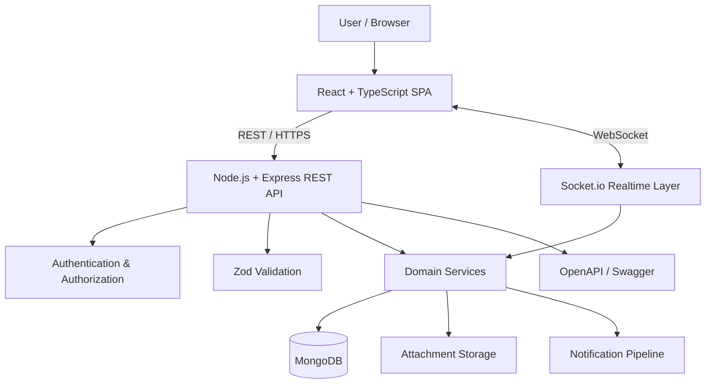
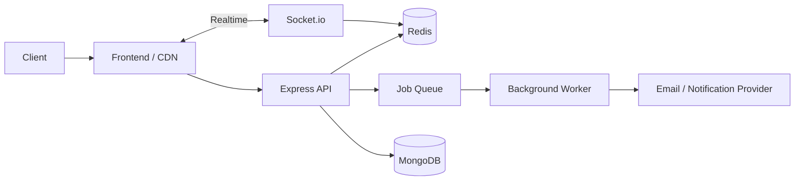

# TaskFlow — Collaborative Work Management Platform

<p align="center">
  <strong>A production-style full-stack SaaS platform for collaborative task, project, and workspace management.</strong>
</p>

<p align="center">
  Built with React, TypeScript, Node.js, Express, MongoDB, Mongoose and Socket.io.
</p>

<p align="center">
  
  
  
  
  
  
  
  
</p>

---

## Overview

TaskFlow is a full-stack collaborative work management application designed to go beyond a basic CRUD todo app.

The platform combines:

- authentication and session management
- multi-user workspaces
- role-based access control
- project collaboration
- task sharing
- real-time updates
- notifications and reminders
- file attachments
- analytics
- recurring tasks
- comments and activity tracking
- import/export functionality
- automated testing
- API documentation
- Docker-based development

The project focuses on software engineering concepts commonly found in production SaaS applications, including authorization boundaries, API versioning, domain separation, validation, collaborative state synchronization, testing, and deployment-oriented architecture.

---

# ✨ Key Features

## 🔐 Authentication & Identity

TaskFlow supports multiple authentication mechanisms:

- User registration
- Email/password login
- JWT access tokens
- Refresh-token sessions
- Google OAuth
- Passkey authentication
- Protected API routes
- Session refresh flow
- Logout and session invalidation

Authentication logic is enforced on the backend and separated from frontend UI state.

---

## ✅ Advanced Task Management

Users can create and manage tasks with:

- Title
- Description
- Status
- Priority
- Due date
- Assignee
- Recurrence
- Subtasks
- Linked resources
- Attachments
- Comments
- Activity history

Tasks can exist inside collaborative workspaces or as personal tasks.

---

## 👥 Workspaces

TaskFlow supports multi-user workspace collaboration.

Each workspace can contain:

- Members
- Projects
- Tasks
- Invitations
- Activity
- Shared resources

Workspace access is controlled through role-based permissions.

### Workspace Roles

| Role | Permissions |
|---|---|
| `owner` | Full workspace access, member management, invite creation and administrative control |
| `admin` | Member management and invite creation |
| `member` | Create and manage workspace tasks and collaborate |
| `viewer` | Read-oriented workspace access |

Authorization rules are enforced by the backend rather than relying only on frontend visibility.

---

## 📁 Projects

Workspaces can contain multiple projects.

Projects provide an additional authorization boundary for:

- Tasks
- Members
- Assignments
- Collaboration
- Activity
- Permissions

### Project Roles

- `owner`
- `admin`
- `member`
- `viewer`

Each role has project-specific read and write permissions.

---

## 🔗 Personal Task Sharing

Personal tasks can also be shared independently from workspaces.

Supported ACL roles:

| Permission | Access |
|---|---|
| `viewer` | Can view the shared task |
| `editor` | Can view and update the shared task |

This provides task-level access control in addition to workspace and project permissions.

---

## ⚡ Real-Time Collaboration

TaskFlow uses **Socket.io** for real-time updates.

Connected users can receive updates when collaborative resources change, reducing the need for manual page refreshes.

Real-time events can be used for:

- Task updates
- Assignment changes
- Comments
- Notifications
- Workspace activity
- Project changes

---

## 💬 Comments & Activity Feed

Collaborators can communicate directly through task comments.

TaskFlow also maintains activity information for important actions such as:

- Task creation
- Status changes
- Assignment changes
- Comments
- Workspace updates
- Project activity
- Sharing actions

This gives teams visibility into how collaborative work evolves over time.

---

## 🔔 Notifications

The platform includes an in-app notification system and reminder pipeline.

Notifications can be generated for events such as:

- New assignments
- Task updates
- Upcoming deadlines
- Invitations
- Comments
- Shared tasks
- Collaboration events

---

## 📊 Analytics Dashboard

TaskFlow includes analytics for understanding task and project activity.

Dashboard data can be used to visualize:

- Task status distribution
- Priority distribution
- Completion progress
- Upcoming deadlines
- Overdue tasks
- Team activity
- Project workload

---

## 🔁 Recurring Tasks

Tasks can include recurrence rules for repeating workflows.

Examples include:

- Daily tasks
- Weekly tasks
- Monthly tasks
- Repeated reminders

This allows TaskFlow to support recurring operational work rather than only one-time tasks.

---

## 📎 Attachments

Users can upload and associate files with tasks.

Attachments allow collaborators to keep relevant resources connected directly to the work they belong to.

---

## 📥 Import & Export

TaskFlow supports data portability using:

- CSV import
- CSV export
- JSON import
- JSON export

Compatibility mapping is included to handle different input structures where required.

---

## 📚 OpenAPI / Swagger Documentation

The REST API is documented using OpenAPI.

Available development endpoints:

```text
Swagger UI
http://localhost:5000/docs

Versioned Swagger UI
http://localhost:5000/api/v1/docs

OpenAPI JSON
http://localhost:5000/openapi.json
````

API responses expose the contract version through:

```http
X-API-Version: 1.0
```

---

# 🧱 Technology Stack

## Frontend

* React
* TypeScript
* Vite
* SPA routing
* API client layer
* Dashboard UI
* Real-time Socket.io client

## Backend

* Node.js
* Express
* TypeScript
* REST API
* Socket.io
* JWT authentication
* OAuth
* Service-based business logic

## Database

* MongoDB
* Mongoose

## Validation

* Zod

## Testing

* Vitest
* Supertest
* mongodb-memory-server
* Unit tests
* Integration tests
* End-to-end testing support

## DevOps & Documentation

* Docker
* Docker Compose
* OpenAPI
* Swagger
* Git
* GitHub

---

# 🏗️ System Architecture



---

# 🗂️ Application Structure

```text
TaskFlow/
│
├── frontend/
│   ├── src/
│   │   ├── components/
│   │   ├── pages/
│   │   ├── hooks/
│   │   ├── services/
│   │   ├── context/
│   │   ├── types/
│   │   └── utils/
│   │
│   ├── public/
│   ├── package.json
│   └── vite.config.ts
│
├── backend/
│   ├── src/
│   │   ├── controllers/
│   │   ├── routes/
│   │   ├── models/
│   │   ├── services/
│   │   ├── validators/
│   │   ├── middleware/
│   │   ├── config/
│   │   ├── utils/
│   │   └── tests/
│   │
│   ├── .env.example
│   └── package.json
│
├── database/
│   ├── migrations/
│   └── schema-docs/
│
├── docs/
│   ├── DEPLOYMENT.md
│   └── API documentation
│
├── docker-compose.yml
├── package.json
├── LICENSE
└── README.md
```

---

# 🧩 Backend Architecture

The backend is separated into focused modules.

### `controllers/`

Handle incoming HTTP requests and responses.

Controllers should remain relatively thin and delegate business rules to services.

### `routes/`

Define REST endpoints and connect them to:

* controllers
* middleware
* validation
* authentication

### `models/`

Contain Mongoose schemas and database models.

### `services/`

Contain application and domain logic.

Examples include:

* Task operations
* Workspace permissions
* Project access
* Notifications
* Invitations
* Authentication

### `validators/`

Use Zod schemas to validate API input before requests reach business logic.

### `middleware/`

Contains reusable Express middleware for:

* Authentication
* Authorization
* Validation
* Error handling
* Request processing

---

# 🔐 Authorization Model

TaskFlow uses multiple authorization levels.

```text
User
 │
 ├── Personal Tasks
 │      └── Task ACL
 │             ├── Viewer
 │             └── Editor
 │
 └── Workspace
        │
        ├── Workspace Role
        │      ├── Owner
        │      ├── Admin
        │      ├── Member
        │      └── Viewer
        │
        └── Project
               └── Project Role
                      ├── Owner
                      ├── Admin
                      ├── Member
                      └── Viewer
```

Authorization checks are performed server-side for both resource visibility and mutations.

---

# 🔒 Security

TaskFlow applies multiple security practices.

Implemented or designed controls include:

* JWT-based authentication
* Refresh-token session management
* Backend-enforced authorization
* Workspace RBAC
* Project RBAC
* Task-level ACL
* Zod request validation
* Protected API routes
* CORS configuration
* Centralized error handling
* Environment-based secrets
* OAuth credential isolation
* Separation of authentication and application logic

Secrets must never be committed to the repository.

---

# 🚀 Getting Started

## Prerequisites

Make sure the following are installed:

* Node.js
* npm
* MongoDB

Optional:

* Docker
* Docker Compose

---

## 1. Clone the Repository

```bash
git clone https://github.com/hkokk1234/Full-stack-TODO-app-.git
cd Full-stack-TODO-app-
```

---

## 2. Install Dependencies

Install backend dependencies:

```bash
npm --prefix backend install
```

Install frontend dependencies:

```bash
npm --prefix frontend install
```

---

# ⚙️ Environment Configuration

Create:

```text
backend/.env
```

using:

```text
backend/.env.example
```

as the template.

At minimum configure:

```env
MONGO_URI=
JWT_SECRET=
REFRESH_TOKEN_SECRET=
FRONTEND_ORIGIN=
```

Optional integrations may require:

```env
GOOGLE_CLIENT_ID=
GOOGLE_CLIENT_SECRET=
GOOGLE_REDIRECT_URI=
```

Email functionality may require SMTP configuration.

If AI-powered functionality is enabled:

```env
OPENAI_API_KEY=
```

Never commit real secrets.

---

# ▶️ Run in Development

Open two terminals.

## Backend

```bash
npm run dev:backend
```

Backend:

```text
http://localhost:5000
```

## Frontend

```bash
npm run dev:frontend
```

Frontend:

```text
http://localhost:5173
```

---

# 🧪 Quality Checks

Run TypeScript checks:

```bash
npm run typecheck
```

Run tests:

```bash
npm run test
```

Create production builds:

```bash
npm run build
```

---

# 🧪 Testing

The project includes automated testing across different layers.

Testing technologies:

* Vitest
* Supertest
* mongodb-memory-server

The test suite is designed to cover areas such as:

* Authentication
* Task CRUD
* Input validation
* Workspace access
* Project authorization
* Task sharing
* API behavior
* Error handling
* Service logic

Run tests with:

```bash
npm run test
```

If coverage reporting is configured:

```bash
npm run test:coverage
```

> Coverage percentages should only be added to this README when generated from the actual test suite.

---

# 🐳 Docker

TaskFlow can also be run using Docker.

Start containers:

```bash
npm run docker:up
```

View logs:

```bash
npm run docker:logs
```

Stop containers:

```bash
npm run docker:down
```

Docker provides a more reproducible local development environment and reduces differences between developer machines.

---

# 🗄️ Database Migrations

Create a new migration:

```bash
npm --prefix backend run migrate:create -- your_migration_name
```

Apply migrations:

```bash
npm --prefix backend run migrate:up
```

Rollback the latest migration:

```bash
npm --prefix backend run migrate:down
```

---

# 🌐 API Documentation

Once the backend is running:

### Swagger UI

```text
http://localhost:5000/docs
```

### Versioned API Documentation

```text
http://localhost:5000/api/v1/docs
```

### OpenAPI Specification

```text
http://localhost:5000/openapi.json
```

---

# 📸 Screenshots

## Application Interface


---

# 🧠 Engineering Challenges

## Multi-Level Authorization

One of the main engineering challenges in TaskFlow is authorization.

The application supports permissions at several different scopes:

```text
Workspace
    ↓
Project
    ↓
Task
```

A user may have permission to access a workspace without necessarily having the same level of access to every project.

Personal tasks may also have separate sharing rules.

Because of this, authorization is enforced on the backend at the resource level rather than relying on frontend UI restrictions.

---

## Real-Time Synchronization

Collaborative applications need to keep multiple clients synchronized.

TaskFlow uses Socket.io to propagate updates to connected users when collaborative data changes.

This avoids requiring users to refresh their browser after actions performed by other team members.

---

## Authentication & Session Management

The application separates short-lived authentication from longer-running user sessions.

JWT access tokens and refresh sessions allow the application to balance usability with improved session security.

---

## Flexible Task Domain

Tasks support more than simple title/status CRUD.

The domain includes:

* recurrence
* subtasks
* resources
* assignments
* sharing
* comments
* attachments
* priority
* deadlines
* notifications

This requires business logic to remain separate from route and controller code.

---

## Collaborative Access Control

TaskFlow combines:

* Workspace roles
* Project roles
* Personal task ACLs

This makes authorization more complex than a single global `admin/user` system and better reflects multi-tenant SaaS authorization models.

---

# 🧭 Design Decisions

## Why React + TypeScript?

React provides a component-oriented architecture suitable for interactive dashboards and collaborative interfaces.

TypeScript adds static type checking and improves maintainability across a growing frontend codebase.

---

## Why Node.js + Express?

The backend uses Node.js and Express because they integrate naturally with TypeScript and support both REST APIs and real-time Socket.io communication in the same ecosystem.

---

## Why MongoDB?

TaskFlow contains flexible entities such as:

* tasks
* recurrence rules
* comments
* activity metadata
* subtasks
* notifications
* linked resources

MongoDB provides flexible document storage, while Mongoose adds schema definitions and validation at the application layer.

---

## Why Zod?

Zod provides runtime request validation while integrating directly with TypeScript.

This helps ensure that API input is validated before reaching business logic.

---

## Why Socket.io?

TaskFlow requires server-pushed updates for collaborative functionality.

Socket.io provides:

* WebSocket communication
* reconnection handling
* rooms
* event-based messaging

and integrates well with the existing Node.js backend.

---

## Why Separate Controllers and Services?

Controllers handle HTTP-specific concerns.

Services handle business rules.

This separation makes application logic easier to:

* test
* reuse
* maintain
* refactor

and prevents controllers from becoming overly complex.

---

# 📈 Potential Future Improvements

Planned or possible future improvements include:

* Redis-backed caching
* BullMQ background workers
* Distributed reminder processing
* Advanced audit logs
* Real-time user presence
* Optimistic concurrency handling
* Improved observability
* Metrics and tracing
* Cloud deployment
* Kubernetes deployment
* CI/CD deployment pipeline
* Offline task synchronization
* Advanced search
* Full-text indexing

---

# 🔭 Possible Production Architecture

A future scaled deployment could use:



This architecture could support:

* asynchronous reminders
* distributed workers
* caching
* horizontal API scaling
* scalable Socket.io communication

---

# 🛡️ Environment & Secret Management

Never commit:

```text
.env
.env.local
*.pem
private keys
OAuth secrets
API keys
database passwords
JWT secrets
```

Example `.gitignore` entries:

```gitignore
# Dependencies
node_modules/

# Environment
.env
.env.*
!.env.example

# Build output
dist/
build/

# Testing
coverage/

# Logs
*.log
logs/

# OS
.DS_Store
Thumbs.db

# IDE
.vscode/
.idea/

# Temporary files
tmp/
temp/
```

Use GitHub Actions Secrets or the relevant cloud secret-management mechanism for deployed environments.

If any credential has ever been committed publicly, rotate it immediately.

---

# 🚢 Deployment

Deployment-related documentation is available in:

```text
docs/DEPLOYMENT.md
```

A production deployment should configure separate environments for:

```text
Development
    ↓
Staging
    ↓
Production
```

Each environment should use independent:

* database credentials
* JWT secrets
* OAuth credentials
* frontend origins
* API URLs
* service secrets

---

# 🗺️ Roadmap

* [ ] Add Redis-backed caching
* [ ] Move reminder processing to background workers
* [ ] Add advanced workspace audit logs
* [ ] Add real-time user presence
* [ ] Expand automated integration testing
* [ ] Add production monitoring and metrics
* [ ] Deploy frontend and API
* [ ] Add automated CI/CD deployment
* [ ] Explore Kubernetes deployment

---

# 🤝 Contributing

Contributions, suggestions and bug reports are welcome.

A typical development workflow:

```bash
git checkout -b feature/your-feature
```

Make your changes and commit them:

```bash
git commit -m "feat: add your feature"
```

Push the branch:

```bash
git push origin feature/your-feature
```

Then open a Pull Request.

---

# 📄 License

This project is licensed under the **MIT License**.

See the [`LICENSE`](LICENSE) file for details.

---

# 👨‍💻 Author

**Harrys (Zacharias Kokkinakis)**

Integrated Master's Student in Information & Communication Systems Engineering
University of the Aegean

GitHub:

[github.com/hkokk1234](https://github.com/hkokk1234)

---

## ⭐ Project Goal

TaskFlow was built to explore how a modern collaborative SaaS application can be designed beyond basic CRUD functionality.

The project demonstrates concepts including:

* Full-stack software engineering
* API design
* Authentication
* Authorization
* Multi-tenant collaboration
* Real-time systems
* Database modelling
* Validation
* Testing
* Docker
* API documentation
* Security
* Production-oriented architecture

If you find the project useful, consider giving the repository a ⭐.

```
```

